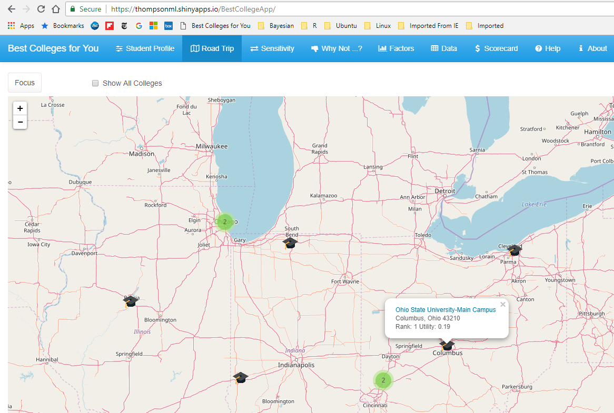

# Introduction

How'd you like to explore the landscape of 4-year colleges in the USA? 

## Motivation

My family and I answered this question a couple of years ago with an enthusiastic "We'd love to!"  Not because we have some great love for college exploration.  But, because our daughter would soon be applying to colleges.  Class of '16, she was excited about all the possibilities that college offered.  

In her case, she had earned a spot as a National Merit Finalist, so she rightfully thought the sky's the limit.  But what if her dream school(s) didn't accept her?  What was going to be her Plan B?  What if she wasn't so sure she really wanted to major in a STEM (science, technology, engineering, math) field but instead wanted to pursue her music and art -- all at which she showed proficiency?  What about locale, region? Classmates, roommates, professors, campus ambience, etc. etc. etc?  And costs?

And then ... where to start? Soon, excitement risked fading into disillusionment ... bewilderment ... anxiety ....

 <!-- .element height="50%" width="50%" -->

## Solutions

The typical free online resources were far too generic.  As template-driven filters, online tools just screened out eveything not in the particular region, size or cost range you specified.  Sure, there were fee-based services, but what we were looking for was something with a much lighter engagement yet still with a way to show a list of colleges that satisfied some level of customized prioritization -- importance weighting, if you will -- of the criteria driving our selection.

Well, thankfully, the U.S. Department of Education had just released its [College Scorecard](https://collegescorecard.ed.gov/data/) data.  And to slap icing on that cake, [Kaggle](https://kaggle.com) had just started an open "swag" posting that [College Scorecard dataset]().  And the *coup de grace*, I'm good at math modeling & know my way around data ([see me...](https://www.linkedin.com/in/mlthomps/)).

So, I entered the Kaggle contest, won a nod as ["Script of the Week" for January 8, 2016](http://blog.kaggle.com/2016/02/19/december-2015-january-2016-scripts-of-the-week/), and got a Kaggle t-shirt out of it!

Encouraged by this outcome and looking to build an easy-to-use tool, I whipped up an R Shiny app to help us explore the landscape of 4-year colleges in the USA: ["Best Colleges for You"](https://thompsonml.shinyapps.io/BestCollegeApp/)!

## What of It?

In this post, I'll give you a quick run through of the "Best Colleges for You" app to give you an idea of what you might do with it.  Hopefully, the different college rankings it generates just for you will surface some college options you hadn't entertained yet and spark your imagination to explore further afield for a college that's right for you.

# Getting Started

